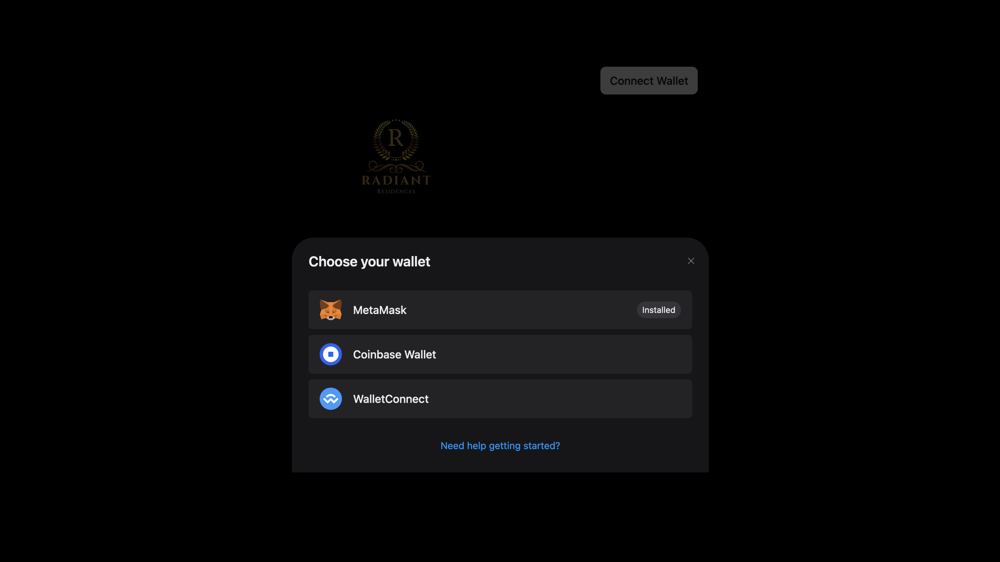
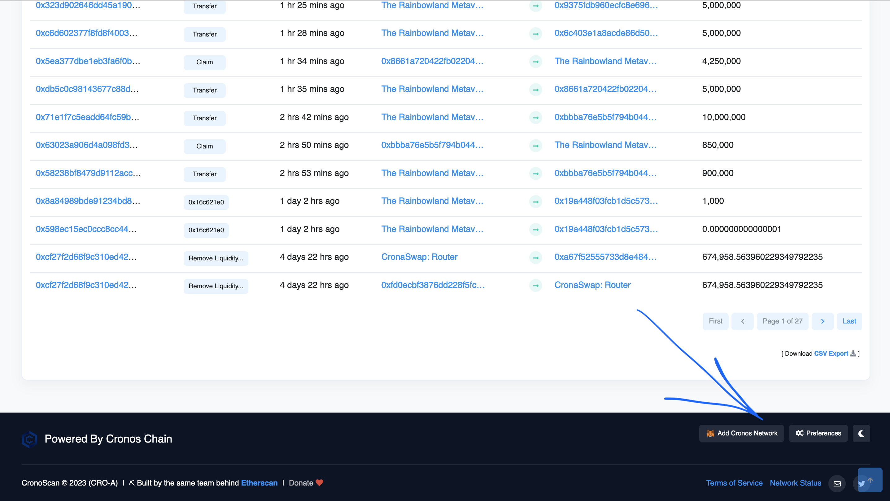
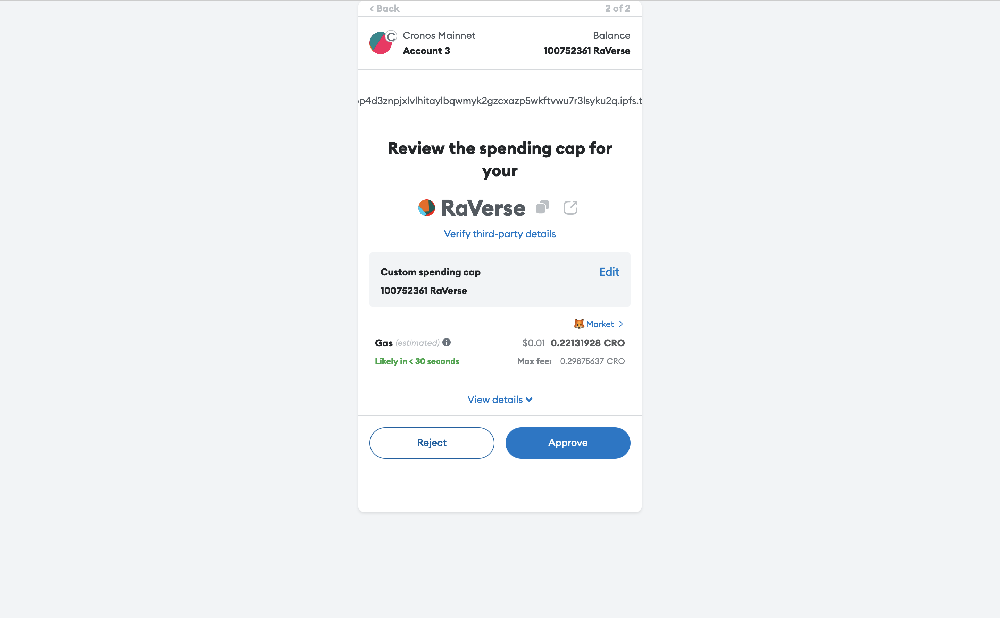
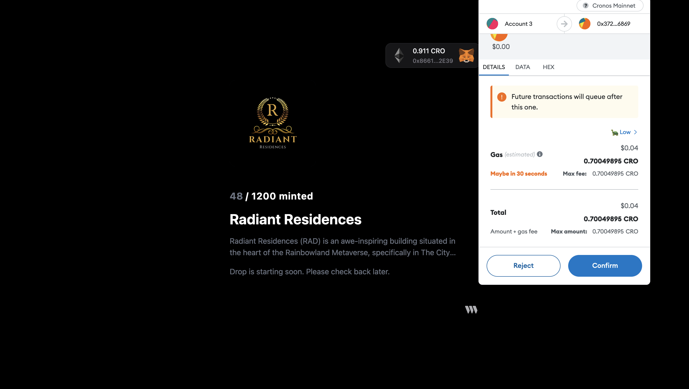
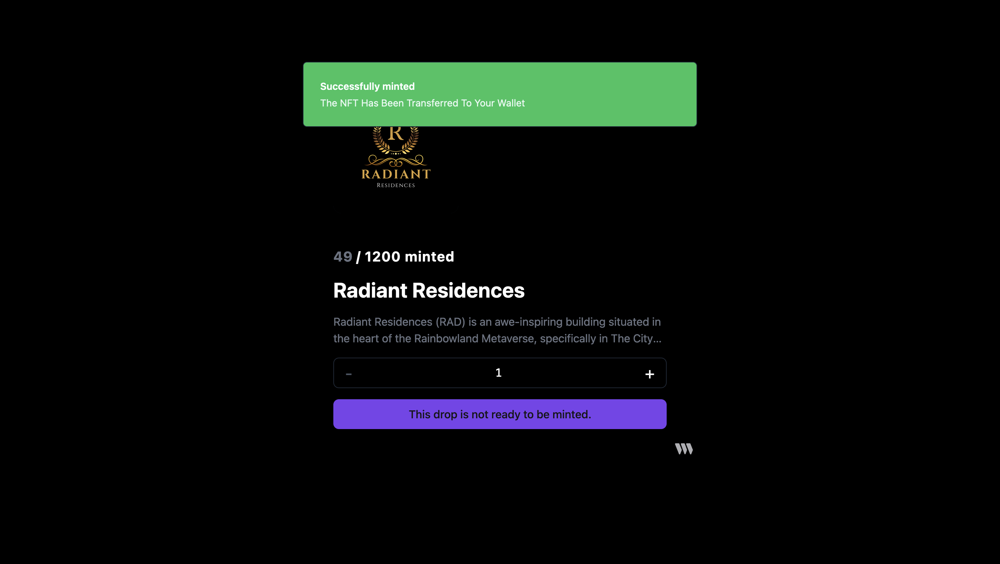

# ℹ Instruction on how to mint

## Start minting your very own piece of Rainbowland history! 

**About Radiant Residences**\
Radiant Residences (RAD) is an awe-inspiring building situated in the heart of the Rainbowland Metaverse, specifically in The City district. This architectural marvel represents a collection of 1,200 luxurious apartments, penthouses, offices, and stores spread across an impressive 108 floors. With one side of the building overlooking the vast sea and the other three sides embracing the bustling urban landscape, Radiant Residences offers a truly captivating living and working experience. By staking Radiant Residences (RAD) NFTs, participants unlock a gateway to a world of lucrative opportunities within the Rainbowland Metaverse.

As a valued member of the Radiant community, your ownership of these prestigious properties allows you to tap into the immense potential for generating passive income. Through the process of staking these NFTs, participants earn rewards in the form of $RaVerse (symbol: $RaVerse), the official currency of the Rainbowland Metaverse. These rewards not only reflect the vibrant economy of Rainbowland but also serve as a testament to your status as an esteemed property owner within the Radiant Residences. Step into the immersive world of Rainbowland and embrace the chance to reap the benefits of your staked Radiant Residences NFTs. Join Radiant Stakings today and become an integral part of the flourishing Rainbowland community while unlocking the potential for both financial growth and enchanting experiences.

### Minting Stage 

* 05 July 2023 — 09 July minting cost is 850K of [**$RAVERSE**](https://cronoscan.com/token/0xd504ab14f8a0eef1c2044b312aa645e027787e97)
* 10 July 2023–10 August 2023 minting cost is **100 CRO (Cronos)**
* Next, listing and verification at Ebisusbay.com with floor price 200 CRO
* Next, listing and verification at Crypto.com NFT with floor price 400 CRO

### Staking Reward 

* Staking reward 50 of [**$RAVERSE**](https://cronoscan.com/token/0xd504ab14f8a0eef1c2044b312aa645e027787e97) for each NFT per hour

### Instruction, how to mint 

1. Go to [**Rainbowland Minting Page**](https://rr.rainbowland.org)

<figure><figcaption></figcaption></figure>

1. Choose your wallet (we are recommend MetaMask). Add Cronos network to your MetaMask wallet, if you don’t have it.

<figure><figcaption></figcaption></figure>

<figure><figcaption></figcaption></figure>

<figure><figcaption>
If you don’t have Cronos network at your MetaMask wallet, go ti Cronoscan.com and add it.
</figcaption></figure>

3\. Choose amount to be minted, each one will cost 850K of [**$RAVERSE**](https://cronoscan.com/token/0xd504ab14f8a0eef1c2044b312aa645e027787e97)

<figure><figcaption></figcaption></figure>

4. Approve spending cap of $RAVERSE, you can choose any amount starting from 850K (because its cost this amount)

<figure><figcaption></figcaption></figure>

5. Sign transaction to approve it (will ask you one time if you will choose max spending amount)

<figure><figcaption></figcaption></figure>

6. Sign next transaction, to mint NFT

<figure><figcaption></figcaption></figure>

7. Successfully minted

<figure><figcaption></figcaption></figure>

Follow for more story about The Rainbowland Metaverse. Next: Staking Instruction for Radiant Residences (RAD)
