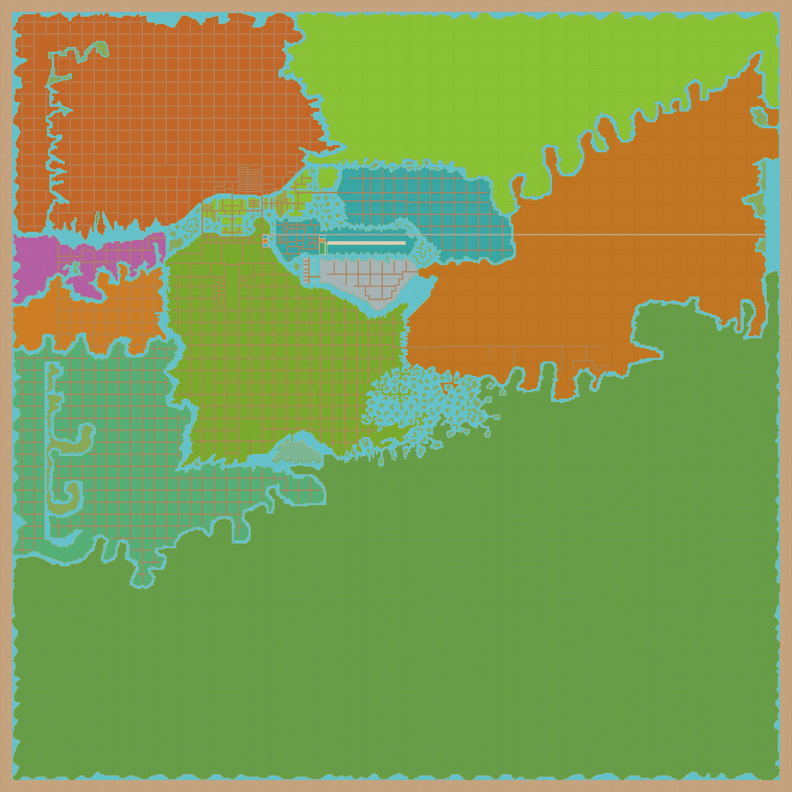

# 🌆 AquaTerra World Map and Districts

<figure><figcaption>
409600 LANDs
</figcaption></figure>

### ⚜️ Map Legend:

* Green or other colors - not listed LANDs
* Brown - Roads
* Blue - Ocean

* X: -128 up to 511
* Y: -128 up to 511
* Total: 409600 LANDs
* 1 LAND = 16 meters by 16 meters (256 sq.m.) = 2755 square feet = 0.063 Acre

***

## ⚜️ District&#x73;**:**

* **The City:** experience the pulse of the metaverse at The City, the capital of AquaTerra World. This bustling metropolis is the center of commerce, culture, and innovation in the virtual world. Explore its towering skyscrapers, bustling streets, and cutting-edge technology. From world-class shopping to top-notch entertainment, The City has everything you could possibly want. Meet new friends, network with like-minded individuals, and discover the endless opportunities that await you in this dynamic virtual world. Whether you're looking for an urban escape or a hub of innovation, The City is the ultimate destination in AquaTerra World. Come and see what all the buzz is about!
* **Rainbowhill** - get ready for a vibrant and colorful adventure in Rainbowhill District of AquaTerra World. This district is a feast for the senses, with its kaleidoscope of hues and playful atmosphere. From rainbow-hued parks to lively street performers, there's never a dull moment in Rainbowhill. Take a leisurely stroll down its streets, grab a bite to eat at one of its many cafes, or dance the night away in one of its many dance clubs. Rainbowhill District is the perfect place to let loose and have fun in Aquaterra World. Whether you're looking for a whimsical escape or a place to socialize, Rainbowhill is the destination for you.
* **Medieval** - step back in time and enter the Medieval District of AquaTerra World, where the essence of the Middle Ages comes to life. Explore the sprawling castles, grand cathedrals, and cobblestone streets as you immerse yourself in a virtual world steeped in history and tradition. From jousting tournaments to medieval feasts, there's always something exciting happening in the Medieval District. Meet new friends, engage in battles, and create unforgettable memories. Whether you're a history buff or just looking for a unique virtual experience, the Medieval District is the perfect destination for you. Come and see for yourself why it's the most popular area of AquaTerra World.
* **Cartoonville** - enter a world of endless fun and excitement in Cartoonville District of AquaTerra Wolrd. This district is inspired by the classic cartoons of yesteryear and is the perfect place for fans of all ages. From thrilling rides to whimsical games, Cartoonville has something for everyone. Meet your favorite cartoon characters, explore fantastical environments, and make memories that will last a lifetime. Whether you're young or just young at heart, Cartoonville District is the ultimate destination for anyone looking for a good time in AquaTerra World. Come and experience the magic of this vibrant and playful district today.
* **Gatsbyville** - step back in time to the roaring twenties in Gatsbyville District of AquaTerra World. This nostalgic district is inspired by the glamour and opulence of the Jazz Age, and is the perfect place to indulge in a touch of vintage luxury. From elegant speakeasies to glittering ballrooms, Gatsbyville is the ultimate destination for anyone looking to experience the golden age of the metaverse. Dress to the nines and rub shoulders with other high society members as you dance the night away to the sounds of jazz music. Whether you're a fan of the era or just looking for a unique virtual experience, Gatsbyville District is the perfect place to be in AquaTerra World.
* **Frozenville** - embark on a magical journey to Frozenville District of AquaTerra World, where the wonder of winter never ends. This frozen wonderland is inspired by the enchanting world of ice and snow, and is the perfect place to escape the heat and experience the chill. From ice-skating rinks to snow-covered forests, Frozenville has everything you could possibly want in a winter wonderland. Meet new friends, play in the snow, and create memories that will last a lifetime. Whether you're looking for a wintry escape or just a unique experience, Frozenville District is the perfect destination for you in AquaTerra World. Come and see the magic for yourself!
* **Desert** - Explore the scorching beauty of the desert at Desert District of AquaTerra World. This vast, sun-baked wasteland is a virtual paradise for anyone who loves the heat and wants to experience the thrill of adventure. From towering sand dunes to ancient ruins, Desert District has something for everyone. Meet new friends, embark on exciting quests, and discover the secrets that lay hidden in the sand. Whether you're a fan of the desert or just looking for a unique virtual experience, Desert District is the perfect destination for you in AquaTerra World. Come and experience the heat today!
* **Voxelville** - discover a world of endless creative potential in Voxelville District of AquaTerra World. This cutting-edge district is a virtual sandbox where you can let your imagination run wild. With its voxel-based graphics and intuitive building tools, you can create anything you can dream of. Whether you're building a castle, designing a city, or just expressing your creativity, Voxelville is the perfect place for you. Meet new friends, collaborate on projects, and see your ideas come to life in a whole new way. Whether you're a seasoned builder or just starting out, Voxelville District is the ultimate destination for anyone looking to explore the power of their imagination in AquaTerra World.
* **Pixelville** - enter a world of retro-inspired fun and excitement in Pixelville District of AquaTerra World. This district is a nod to the classic 8-bit era of gaming, and is the perfect place for anyone who loves nostalgia. From pixelated landscapes to classic arcade games, Pixelville has everything you could want in a virtual world. Meet new friends, play games, and relive the glory days of gaming. Whether you're a fan of the old-school or just looking for a unique virtual experience, Pixelville District is the perfect destination for you in AquaTerra World. Come and experience the magic of the 8-bit era today!
* **Oceania** - dive into the crystal-clear waters of Oceania District in AquaTerra World. This virtual ocean paradise is the ultimate destination for anyone who loves the sea and all its creatures. From vibrant coral reefs to breathtaking underwater landscapes, Oceania has everything you could want in a tropical getaway. Meet new friends, go on adventures, and discover the beauty of the ocean. Whether you're a fan of the sea or just looking for a unique virtual experience, Oceania District is the perfect destination for you in AquaTerra World. Come and explore the wonders of the ocean today!
* **Seaside** - escape to the soothing sounds of the sea at Seaside District of AquaTerra World. This virtual coastal paradise is the perfect place to relax and unwind. From sandy beaches to gently rolling waves, Seaside District has everything you could want in a seaside getaway. Meet new friends, explore the many sights, and discover the peace of the ocean. Whether you're a fan of the coast or just looking for a peaceful escape, Seaside District is the perfect destination for you in AquaTerra World. Come and experience the beauty of the sea today!
* **Lakeside** - discover the calm and serenity of a mountain lake in Lakeside District of AquaTerra World. This idyllic virtual world is the perfect place to escape the hustle and bustle of the real world. From peaceful fishing holes to picturesque vistas, Lakeside District has everything you could want in a lakeside getaway. Meet new friends, explore the many trails, and discover the beauty of the mountains. Whether you're a fan of the lake or just looking for a peaceful escape, Lakeside District is the perfect destination for you in AquaTerra World. Come and experience the tranquility of the lake today!"
* **Riverside** - discover the rush of whitewater rapids in RiverSide District of AquaTerra World. This virtual world is the perfect place for anyone who loves the thrill of the outdoors. From fast-moving streams to breathtaking waterfalls, RiverSide District has everything you could want in an adrenaline-fueled adventure. Meet new friends, explore the many trails, and experience the rush of the river. Whether you're a fan of rafting or just looking for a unique virtual experience, RiverSide District is the perfect destination for you in AquaTerra World. Come and experience the thrill of the river today!
* **Forest** - Escape to the tranquil beauty of nature in Forest District of AquaTerra World. This lush and verdant virtual world is the perfect place to reconnect with the great outdoors. From towering trees to babbling brooks, Forest District has everything you could want in a peaceful escape. Meet new friends, explore the many trails, and discover the secrets hidden within the trees. Whether you're a fan of the forest or just looking for a peaceful getaway, Forest District is the perfect destination for you in AquaTerra World. Come and experience the tranquility of nature today!
* **Factory** - Join the hustle and bustle of the Factory - the land of business, stores, factories and more! Make your mark in the Metaverse with a piece of this thriving virtual world.
* **Departures Zone** - Discover the gateway to the metaverse at Departures Zone District of AquaTerra World. This bustling district is the first stop for anyone entering the virtual world, and is the hub of activity for both newcomers and veterans alike. From helpful guides to essential resources, Departures Zone has everything you need to get started on your virtual journey. Meet new friends, explore the many opportunities available in AquaTerra World, and discover a whole new world waiting for you. Whether you're just starting out or a seasoned traveler, Departures Zone District is the ultimate hub for anyone looking to enter the metaverse. Come and see what awaits you in AquaTerra World! Party Island - best music, famous DJs, party non stop, 24/7
* **Celebrity District** - step into the limelight at Celebrity District of AquaTerra World. This virtual world is the ultimate destination for anyone looking to live like a star. From glamorous red carpets to high-end clubs and shops, Celebrity District has everything you could want in a celebrity experience. Meet new friends, rub shoulders with virtual celebrities, and experience life in the fast lane. Whether you're a fan of the spotlight or just looking for a unique virtual experience, Celebrity District is the perfect destination for you in Rainbowland Metaverse. Come and live like a star today!
* **Party Island** - Get ready for non-stop fun and excitement at Party Island District of AquaTerra World! This virtual world is the ultimate destination for anyone looking to let loose and have a good time. From wild dance parties to beach barbecues and everything in between, Party Island has it all. Meet new friends, dance the night away, and experience the wildest virtual parties you've ever seen. Whether you're a fan of good times or just looking for a fun escape, Party Island District is the perfect destination for you in AquaTerra World. Come and party like never before!
* Agora - discover the vibrant and bustling heart of the AquaTerra World with the Agora District. As the owner of this unique item, you'll have exclusive access to one of the most sought-after locations in the virtual world. The Agora District is the hub of commerce, entertainment, and community in the AquaTerra World, making it the perfect place to establish your virtual presence. Whether you're looking to build a thriving virtual business, a luxurious virtual home, or just to experience the excitement of the virtual world, the Agora District is the place to be. With its vibrant culture and bustling energy, this district offers endless opportunities for growth and exploration. With a limited supply, this item is a rare and valuable collectible for fans of the metaverse. Don't miss your chance to own a piece of the Rainbowland Metaverse with this Agora District NFT.
*   In The Digital Graveyard, not only can you explore the remnants of technology and meet the spirits of digital entities, but you also have the opportunity to perpetuate the digital identity of a loved one after their passing. This groundbreaking feature allows individuals to keep the memory of their loved ones alive in the digital world, ensuring that their legacy will never be forgotten.\

    With this unique option, families and friends can create a virtual memorial for their loved ones, complete with personal memories, photos, and messages. These digital memorials serve as a permanent tribute to the life and legacy of the deceased, preserving their memory for future generations to remember and cherish.\

    So, if you are looking for a way to honor and remember your loved ones, come to The Digital Graveyard. Here, you can ensure that their memory will live on forever in the digital world. Join us in this exciting new chapter of the AquaTerra World and experience the power of perpetuating the digital identity of any persons.&#x20;
