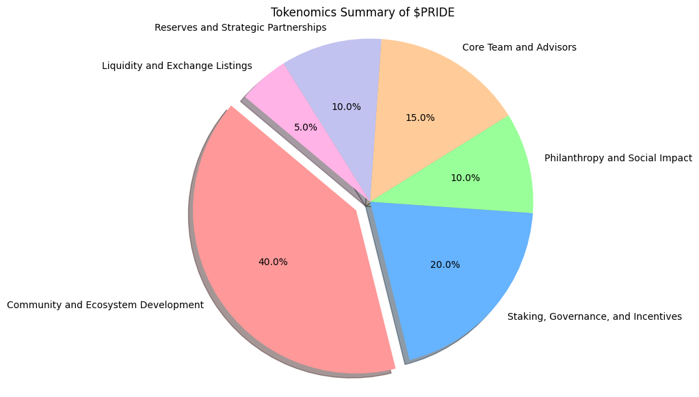

# 🏦 Tokenomics & Distribution of $PRIDE Coin: The Core of Rainbowland Metaverse

<figure><figcaption>
Tokenomics &#x26; Distribution of $PRIDE Coin: The Core of Rainbowland Metaverse
</figcaption></figure>

## ⚜️ Overview

<mark style="color:blue;">**$PRIDE (LGBTQ) on Ethereum chain**</mark>\
**Max Total supply:** 1,000,000,000,000\
**Total Supply:** 101,182,211,718,912\
**Decimals:** 18

**Overview of $PRIDE Coin**

The **$PRIDE Coin** serves as the **premium currency** of the **Rainbowland Metaverse**, offering a wide array of functionalities that empower the LGBTQ community. It acts as a hard currency designed to facilitate transactions, unlock premium content, and engage the community in ways that promote inclusivity, social impact, and economic opportunity. The following section details the tokenomics and distribution of $PRIDE Coin, focusing on how it supports various community-driven initiatives and gameplay functions.

***

**Distribution of $PRIDE Coin**

1. **Community and Ecosystem Development (40%)**
   * **In-Game Rewards and Engagement**: $PRIDE is allocated for in-game activities, including rewards for completing challenges, participating in events, and reaching milestones. This helps keep the community actively engaged, while incentivizing skill development and participation.
   * **Social and Charitable Initiatives**: A portion of this allocation supports community-driven projects, LGBTQ-friendly causes, and charitable initiatives. These efforts foster social responsibility and allow players to contribute to real-world impacts.
2. **Staking, Governance, and Incentives (20%)**
   * **Staking Rewards**: Users who stake $PRIDE can earn passive income in the form of additional tokens. This creates a long-term investment structure, allowing the community to benefit from holding and supporting the ecosystem.
   * **Governance Participation**: Holders of $PRIDE have the power to influence decisions regarding the Metaverse’s future. From event planning to the implementation of new features, governance votes allow the community to have a direct impact on how Rainbowland evolves.
   * **Incentives for Land and Property Development**: $PRIDE holders can use their tokens to develop virtual real estate and businesses, fostering growth within the Metaverse’s virtual economy. This empowers players to invest in digital land and assets, generating a sustainable ecosystem.
3. **Philanthropy and Social Impact (10%)**
   * **Funding LGBTQ Organizations and Causes**: $PRIDE enables seamless donations to LGBTQ organizations, health initiatives, and advocacy groups. This allocation is designed to provide ongoing support to LGBTQ-focused non-profits and charities, promoting real-world progress through virtual engagement.
   * **Financial Aid for LGBTQ Individuals**: $PRIDE acts as a tool for supporting community members in need. Tokens are distributed to help individuals facing hardship, discrimination, or financial difficulty, promoting equality and providing economic lifelines.
4. **Core Team and Advisors (15%)**
   * This allocation ensures that the development team and advisors receive the necessary resources to continue building, maintaining, and improving the Rainbowland Metaverse. It aligns their efforts with the long-term success and sustainability of the project.
5. **Reserves and Strategic Partnerships (10%)**
   * **Partnership Development**: $PRIDE reserves will be used to establish and nurture partnerships within the GameFi, **NFT**, **Bitcoin**, and **Ordinals** ecosystems, further integrating the token with other platforms and communities. These partnerships will expand the reach and utility of $PRIDE beyond Rainbowland.
   * **Platform Expansion**: Reserves are also set aside to fund future expansions and developments, ensuring the longevity and growth of Rainbowland’s virtual economy.
6. **Liquidity and Exchange Listings (5%)**
   * A portion of the total supply is allocated for liquidity provision on decentralized and centralized exchanges, ensuring that $PRIDE can be traded easily and has a stable presence in the broader cryptocurrency market.

***

#### **Use Cases and Functionality**

1. **In-Game Purchases and Asset Development**
   * **Purchasing Virtual Goods and NFTs**: Players can use $PRIDE to acquire premium items, exclusive NFTs, and customizations within the Metaverse, enriching their virtual experience and status within the game.
   * **Building and Upgrading Properties**: Players spend $PRIDE to construct and upgrade their digital real estate, allowing them to create personalized spaces or build businesses in key locations. Property upgrades can offer additional functionalities and exclusive content, giving players a competitive edge.
2. **Philanthropy and Social Impact**
   * **Funding LGBTQ Organizations and Causes**: $PRIDE enables seamless donations to LGBTQ organizations and advocacy initiatives. By integrating philanthropic efforts directly into the economy of the Metaverse, the token becomes a tool for creating real-world change.
   * **Providing Financial Support for Individuals**: Community members can use $PRIDE to offer financial assistance to those facing discrimination or hardship, fostering economic empowerment and equality within Rainbowland.
3. **Staking and Governance**
   * **Staking for Rewards**: Players can stake $PRIDE for passive income, earning additional tokens while actively supporting the health of the economy. Staking rewards incentivize long-term engagement and investment in the Metaverse.
   * **Voting Rights in Governance**: Holders of $PRIDE have voting power in the **Rainbowland DAO**, giving them direct influence over major decisions, from feature implementations to game updates and policies. This democratic approach ensures that the community actively shapes the world in which they participate.
4. **Facilitating LGBTQ-Friendly Travel**
   * **Covering Travel Expenses**: Players can use $PRIDE to pay for virtual travel-related costs within the Metaverse, such as hotel stays, transportation, and premium travel services. This feature promotes exploration and connection across LGBTQ-friendly destinations, creating a safe and inclusive environment for all.
5. **Energy Boost and Action Points**
   * **Gameplay Enhancements**: $PRIDE enables players to restore action points or reduce cooldown timers, allowing them to progress faster and engage in more activities. This provides a competitive advantage for players who want to maximize their in-game activities.
6. **NFT Creation and Marketplace**
   * **LGBTQ-Themed NFTs**: Artists and creators can use $PRIDE to mint, buy, and sell LGBTQ-themed NFTs within the Metaverse. This feature celebrates LGBTQ culture and art, fostering a vibrant marketplace where creators are empowered to showcase their talents.

***

#### **Tokenomics Summary**

* **Total Supply**: 1 Billion $PRIDE
* **Distribution**:
  * **Community and Ecosystem Development**: 40%
  * **Staking, Governance, and Incentives**: 20%
  * **Philanthropy and Social Impact**: 10%
  * **Core Team and Advisors**: 15%
  * **Reserves and Strategic Partnerships**: 10%
  * **Liquidity and Exchange Listings**: 5%

#### Conclusion

**$PRIDE Coin** is the **premium hard currency** that fuels the **Rainbowland Metaverse**, providing a wide array of in-game functionalities and empowering the LGBTQ community both in the virtual and real worlds. Its thoughtful allocation ensures long-term engagement, economic sustainability, and social impact, allowing players to shape and experience the Metaverse in meaningful ways. Through $PRIDE, the Rainbowland Metaverse becomes not only a place of exploration and creativity but also a beacon of unity, acceptance, and progress for the LGBTQ community and its allies.
