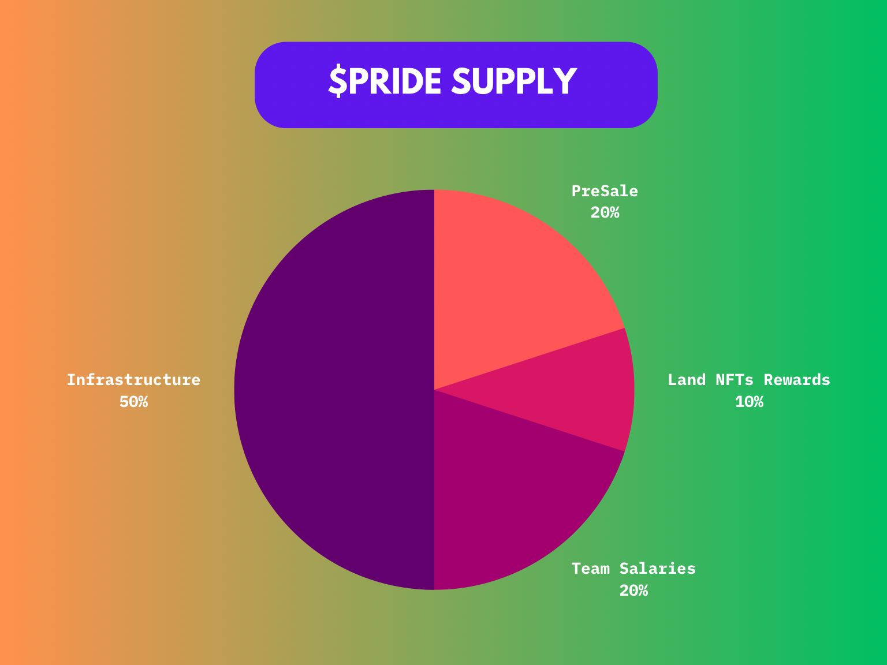

# 🏦 Tokenomics & Distribution

## ⚜️ Overview

<mark style="color:blue;">**$PRIDE (LGBTQ) on Ethereum chain**</mark>\
**Max Total supply:** 1,000,000,000,000\
**Total Supply:** 101,182,211,718,912\
**Decimals:** 18

<figure><figcaption></figcaption></figure>

$PRIDE Coin is more than just a cryptocurrency; it serves as a beacon of hope and empowerment for the LGBTQ community within the Rainbowland Metaverse. As the main currency of this vibrant virtual world, $PRIDE goes beyond traditional financial transactions to create a positive impact. Let’s explore how this unique coin can uplift and support LGBTQ individuals and organizations:

**Supporting LGBTQ-Friendly Businesses**\
In the Rainbowland Metaverse, $PRIDE serves as a means of payment for goods and services at LGBTQ-friendly businesses. By using $PRIDE for transactions, community members actively support establishments that embrace diversity and foster an environment where LGBTQ businesses can thrive. This promotes acceptance and inclusivity throughout the Metaverse.

**Funding LGBTQ Organizations and Causes**\
$PRIDE enables seamless donations to LGBTQ organizations and initiatives. Using $PRIDE for philanthropy allows individuals to directly strengthen efforts that champion LGBTQ rights, health, and social well-being. Together, we can create positive change in the community.

**Facilitating LGBTQ-Friendly Travel**\
Traveling within the Rainbowland Metaverse becomes an inclusive experience with $PRIDE as the preferred currency. Community members can cover travel-related expenses, such as hotel stays and transportation in LGBTQ-friendly destinations worldwide. This encourages exploration, connection, and the celebration of diversity across borders.

**Providing Financial Support for LGBTQ Individuals**\
$PRIDE offers a lifeline for LGBTQ individuals facing hardship or discrimination. It can be used to provide financial assistance within the Metaverse, promoting economic equality and empowerment. $PRIDE creates a supportive network that nurtures belonging and care within the community.

**In-Game Purchases and Rewards**\
Within Rainbowland, $PRIDE is the primary currency for in-game purchases and rewards. Players can use $PRIDE to buy virtual goods, customizations, and exclusive items, enhancing their gaming experiences. Participating in events, completing challenges, and achieving milestones can also earn players $PRIDE, encouraging engagement and skill development.

**Creating LGBTQ-Themed NFTs**\
$PRIDE enables the creation and trading of LGBTQ-themed non-fungible tokens (NFTs), allowing artists and creators to showcase their works. NFTs purchased with $PRIDE represent a shared appreciation for LGBTQ culture and expression, fostering a thriving NFT marketplace in the Rainbowland Metaverse.

**Community Governance and Voting**\
The $PRIDE Coin plays a vital role in community governance within the Metaverse. Holders have voting power to influence decisions on new features, events, and policies, ensuring a democratic approach to shaping the Metaverse’s future. This empowers community members to actively participate in building a world that reflects their values.

**Social and Charitable Initiatives**\
In the spirit of giving back, $PRIDE facilitates social and charitable initiatives. Community-driven projects and fundraisers can be launched, with $PRIDE at the forefront of positive change. By supporting LGBTQ causes, the Metaverse strengthens its commitment to creating a compassionate and supportive environment.

**Educational and Learning Opportunities**\
$PRIDE extends its influence to educational initiatives within the Metaverse. Scholarships, workshops, and skill-building programs can be sponsored using $PRIDE, fostering personal growth and development. These initiatives empower individuals with knowledge and skills that enhance their lives inside and outside the virtual realm.

#### **Embrace the Spirit of $PRIDE**

As the main currency in the Rainbowland Metaverse, $PRIDE symbolizes unity, acceptance, and progress. Its diverse applications touch every aspect of the virtual world, creating an inclusive space where LGBTQ individuals can thrive, connect, and embrace their true selves. By using $PRIDE, members actively contribute to the ongoing development of the Rainbowland Metaverse, shaping it into a vibrant landscape that celebrates LGBTQ culture and achievements.

In summary, $PRIDE Coin is a powerful tool for advancing the visibility, acceptance, and empowerment of LGBTQ individuals and organizations. Through its various applications, $PRIDE represents the collective strength and unity of the LGBTQ community, making a profound impact on the broader ecosystem. Together, let’s build a world where diversity is celebrated, and everyone can live authentically and proudly.

Welcome to the Rainbowland Metaverse, where pride shines brightly in every interaction and endeavor!
